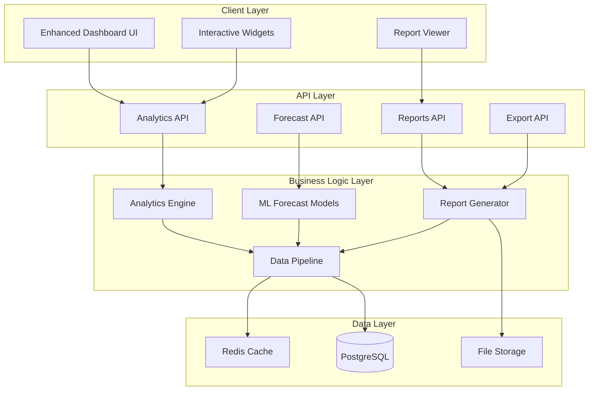

# Design Document: Enhanced Analytics & Reporting System

## Overview

This design transforms the existing e-commerce admin dashboard into a comprehensive business intelligence platform with advanced analytics, predictive modeling, and sophisticated reporting capabilities. The enhanced system will provide real-time insights, forecasting models, and interactive visualizations that enable data-driven decision making across all business operations.

The design leverages modern analytics patterns including real-time data processing, machine learning-powered forecasting, and interactive dashboard widgets to create a differentiated and highly valuable business intelligence solution.

## Architecture

### High-Level Architecture



### Component Architecture

The system follows a modular architecture with clear separation of concerns:

1. **Presentation Layer**: Enhanced React components with advanced visualization libraries
2. **API Layer**: RESTful endpoints for analytics, reporting, and data export
3. **Business Logic Layer**: Core analytics engine, ML models, and report generation
4. **Data Layer**: Optimized database schema with caching for performance

## Components and Interfaces

### Analytics Engine

**Purpose**: Core component responsible for processing business data and generating insights.

**Key Responsibilities**:
- Real-time data aggregation and analysis
- Performance metric calculations
- Trend analysis and pattern recognition
- Customer segmentation and behavior analysis

**Interface**:
```typescript
interface AnalyticsEngine {
  calculateSalesMetrics(dateRange: DateRange, filters?: AnalyticsFilters): Promise<SalesMetrics>
  generateCustomerInsights(segmentId?: string): Promise<CustomerInsights>
  analyzeInventoryPerformance(): Promise<InventoryAnalytics>
  computePerformanceBenchmarks(period: TimePeriod): Promise<BenchmarkData>
}

interface SalesMetrics {
  totalRevenue: number
  growthRate: number
  conversionRate: number
  averageOrderValue: number
  salesByPeriod: TimeSeries[]
  topPerformingProducts: ProductPerformance[]
  salesByCategory: CategoryPerformance[]
}
```

### Forecast Models

**Purpose**: Machine learning component for predictive analytics and demand forecasting.

**Key Responsibilities**:
- Sales forecasting using historical data and seasonal patterns
- Inventory demand prediction
- Customer behavior prediction
- Market trend analysis

**Interface**:
```typescript
interface ForecastModels {
  predictSales(productId: string, horizon: number): Promise<SalesForecast>
  forecastInventoryDemand(timeframe: number): Promise<InventoryForecast>
  predictCustomerChurn(customerId?: string): Promise<ChurnPrediction>
  analyzeTrends(metric: string, period: TimePeriod): Promise<TrendAnalysis>
}

interface SalesForecast {
  productId: string
  predictions: ForecastPoint[]
  confidence: number
  seasonalFactors: SeasonalData[]
  recommendations: string[]
}
```

### Report Generator

**Purpose**: Comprehensive reporting system with multiple output formats and scheduling capabilities.

**Key Responsibilities**:
- Automated report generation
- Multi-format export (PDF, Excel, CSV, HTML)
- Report scheduling and distribution
- Executive summary creation

**Interface**:
```typescript
interface ReportGenerator {
  generateSalesReport(config: ReportConfig): Promise<Report>
  createExecutiveSummary(period: TimePeriod): Promise<ExecutiveSummary>
  scheduleReport(schedule: ReportSchedule): Promise<ScheduledReport>
  exportReport(reportId: string, format: ExportFormat): Promise<ExportResult>
}

interface ReportConfig {
  type: ReportType
  dateRange: DateRange
  includeCharts: boolean
  includeForecasts: boolean
  customMetrics?: string[]
  filters?: ReportFilters
}
```

### Dashboard Widget System

**Purpose**: Modular, interactive UI components for data visualization and real-time monitoring.

**Key Responsibilities**:
- Real-time data display with auto-refresh
- Interactive charts and visualizations
- Customizable dashboard layouts
- Drill-down and filtering capabilities

**Interface**:
```typescript
interface DashboardWidget {
  id: string
  type: WidgetType
  config: WidgetConfig
  data: WidgetData
  refresh(): Promise<void>
  export(format: ExportFormat): Promise<Blob>
}

interface WidgetConfig {
  title: string
  refreshInterval: number
  chartType: ChartType
  metrics: string[]
  filters: WidgetFilters
  customization: WidgetCustomization
}
```

## Data Models

### Enhanced Analytics Schema

```typescript
// Core Analytics Models
interface AnalyticsMetric {
  id: string
  name: string
  value: number
  timestamp: Date
  metadata: Record<string, any>
  tags: string[]
}

interface CustomerSegment {
  id: string
  name: string
  criteria: SegmentCriteria
  customerCount: number
  averageValue: number
  churnRate: number
  createdAt: Date
}

interface ForecastModel {
  id: string
  name: string
  type: ModelType
  accuracy: number
  lastTrained: Date
  parameters: ModelParameters
  status: ModelStatus
}

// Performance Tracking
interface PerformanceMetric {
  id: string
  entityType: 'product' | 'category' | 'customer' | 'campaign'
  entityId: string
  metricType: string
  value: number
  period: TimePeriod
  comparisonValue?: number
  trend: TrendDirection
}

// Advanced Reporting
interface ReportTemplate {
  id: string
  name: string
  description: string
  sections: ReportSection[]
  defaultFilters: ReportFilters
  outputFormats: ExportFormat[]
  isPublic: boolean
}

interface ScheduledReport {
  id: string
  templateId: string
  schedule: CronExpression
  recipients: string[]
  lastRun?: Date
  nextRun: Date
  status: ScheduleStatus
}
```

### Database Schema Extensions

```sql
-- Analytics Tables
CREATE TABLE analytics_metrics (
  id UUID PRIMARY KEY DEFAULT gen_random_uuid(),
  name VARCHAR(255) NOT NULL,
  value DECIMAL(15,2) NOT NULL,
  timestamp TIMESTAMP WITH TIME ZONE DEFAULT NOW(),
  metadata JSONB,
  tags TEXT[],
  created_at TIMESTAMP WITH TIME ZONE DEFAULT NOW()
);

CREATE TABLE customer_segments (
  id UUID PRIMARY KEY DEFAULT gen_random_uuid(),
  name VARCHAR(255) NOT NULL,
  criteria JSONB NOT NULL,
  customer_count INTEGER DEFAULT 0,
  average_value DECIMAL(10,2) DEFAULT 0,
  churn_rate DECIMAL(5,4) DEFAULT 0,
  created_at TIMESTAMP WITH TIME ZONE DEFAULT NOW(),
  updated_at TIMESTAMP WITH TIME ZONE DEFAULT NOW()
);

CREATE TABLE forecast_models (
  id UUID PRIMARY KEY DEFAULT gen_random_uuid(),
  name VARCHAR(255) NOT NULL,
  type VARCHAR(100) NOT NULL,
  accuracy DECIMAL(5,4),
  last_trained TIMESTAMP WITH TIME ZONE,
  parameters JSONB,
  status VARCHAR(50) DEFAULT 'active',
  created_at TIMESTAMP WITH TIME ZONE DEFAULT NOW()
);

CREATE TABLE performance_metrics (
  id UUID PRIMARY KEY DEFAULT gen_random_uuid(),
  entity_type VARCHAR(50) NOT NULL,
  entity_id VARCHAR(255) NOT NULL,
  metric_type VARCHAR(100) NOT NULL,
  value DECIMAL(15,2) NOT NULL,
  period_start DATE NOT NULL,
  period_end DATE NOT NULL,
  comparison_value DECIMAL(15,2),
  trend VARCHAR(20),
  created_at TIMESTAMP WITH TIME ZONE DEFAULT NOW()
);

-- Indexes for performance
CREATE INDEX idx_analytics_metrics_timestamp ON analytics_metrics(timestamp);
CREATE INDEX idx_analytics_metrics_name ON analytics_metrics(name);
CREATE INDEX idx_performance_metrics_entity ON performance_metrics(entity_type, entity_id);
CREATE INDEX idx_performance_metrics_period ON performance_metrics(period_start, period_end);
```

## Correctness Properties

*A property is a characteristic or behavior that should hold true across all valid executions of a system-essentially, a formal statement about what the system should do. Properties serve as the bridge between human-readable specifications and machine-verifiable correctness guarantees.*

<function_calls>
<invoke name="prework">
<parameter name="featureName">enhanced-analytics-reporting

### Property Reflection

After analyzing all acceptance criteria, I've identified several areas where properties can be consolidated to eliminate redundancy and provide more comprehensive validation:

**Consolidation Opportunities:**
- Properties 1.1, 1.4 can be combined into a comprehensive data aggregation property
- Properties 2.1, 2.4 can be combined into a real-time monitoring property  
- Properties 3.1, 3.2, 3.4 can be combined into a comprehensive report generation property
- Properties 4.1, 4.2, 4.3 can be combined into a customer analytics property
- Properties 5.1, 5.4, 5.5 can be combined into an inventory optimization property
- Properties 6.1, 6.2, 6.4 can be combined into a performance analysis property
- Properties 7.1, 7.2, 7.3 can be combined into a data pipeline reliability property
- Properties 8.1, 8.2, 8.4 can be combined into a visualization functionality property

### Analytics Engine Properties

**Property 1: Data Aggregation Consistency**
*For any* sales data and time period specification, aggregating data by different time periods (daily, weekly, monthly) and then summing should equal the total for the overall period, and breakdowns by categories and products should sum to the total revenue
**Validates: Requirements 1.1, 1.4**

**Property 2: Forecast Model Reasonableness**
*For any* historical sales data with sufficient history, forecast predictions should fall within reasonable bounds (not negative, not exceeding historical maximums by more than 200%, confidence intervals should be mathematically valid)
**Validates: Requirements 1.2, 4.5, 5.2**

**Property 3: Mathematical Calculation Accuracy**
*For any* two comparable time periods with known data, growth rate calculations, conversion rates, and performance metrics should be mathematically accurate and consistent with manual calculations
**Validates: Requirements 1.3, 2.3, 6.1**

**Property 4: Pattern Recognition Consistency**
*For any* data with artificially injected known patterns (peaks, seasonal variations, trends), the analytics engine should correctly identify these patterns within acceptable tolerance ranges
**Validates: Requirements 1.5, 6.2**

### Dashboard and Monitoring Properties

**Property 5: Real-Time Update Consistency**
*For any* data change in the system, all affected dashboard widgets and monitoring displays should reflect the change within the specified refresh interval, and all related metrics should remain mathematically consistent
**Validates: Requirements 2.1, 2.4, 7.5**

**Property 6: UI State Management Integrity**
*For any* sequence of dashboard customization operations (add, remove, rearrange widgets), the final state should be persistent across sessions and all widgets should maintain their configuration and data integrity
**Validates: Requirements 2.2**

**Property 7: Progress Calculation Accuracy**
*For any* sales target and current sales amount, progress calculations should be mathematically accurate, and visual indicators should correctly reflect the progress percentage
**Validates: Requirements 2.5**

### Reporting System Properties

**Property 8: Report Generation Completeness**
*For any* report configuration, the generated report should contain all requested components (charts, tables, summaries) in the specified format, and data should be consistent across all export formats
**Validates: Requirements 3.1, 3.2, 3.4**

**Property 9: Report Scheduling Reliability**
*For any* valid schedule configuration, reports should be generated at the correct times within acceptable tolerance, and all scheduled reports should complete successfully or provide clear error messages
**Validates: Requirements 3.3**

**Property 10: Executive Summary Accuracy**
*For any* dataset with known key insights, the generated executive summary should identify and highlight the most significant patterns and provide actionable recommendations based on the data
**Validates: Requirements 3.5**

### Customer Analytics Properties

**Property 11: Customer Analytics Consistency**
*For any* customer transaction history, calculated lifetime value, purchase frequency, segmentation, and churn analysis should be mathematically consistent and customers should be placed in appropriate segments based on their actual behavior patterns
**Validates: Requirements 4.1, 4.2, 4.3, 4.4**

### Inventory Intelligence Properties

**Property 12: Inventory Optimization Accuracy**
*For any* product with sales history and lead time data, calculated optimal stock levels, turnover rates, and reorder recommendations should be mathematically sound and fall within reasonable business ranges
**Validates: Requirements 5.1, 5.4, 5.5**

**Property 13: Inventory Alert Reliability**
*For any* inventory scenario that meets alert criteria (low stock, slow-moving items), appropriate alerts should be generated within the specified timeframe and contain accurate information
**Validates: Requirements 5.3**

### Performance and Benchmarking Properties

**Property 14: Performance Analysis Consistency**
*For any* business data, calculated efficiency metrics, productivity indicators, and opportunity identification should be mathematically accurate and consistent with manual analysis
**Validates: Requirements 6.1, 6.4, 6.5**

**Property 15: Competitive Analysis Accuracy**
*For any* competitive data provided to the system, monitoring and analysis should accurately track pricing and market indicators without data corruption or calculation errors
**Validates: Requirements 6.3**

### Data Pipeline Properties

**Property 16: Data Pipeline Reliability**
*For any* transaction volume within system limits, the data pipeline should process all transactions with sub-second latency, maintain data integrity, handle errors gracefully, and scale processing capacity appropriately
**Validates: Requirements 7.1, 7.2, 7.3, 7.4**

### Visualization Properties

**Property 17: Visualization Functionality Completeness**
*For any* dataset suitable for visualization, the system should correctly render all supported chart types, maintain interactivity across filtering and drilling operations, and support comparison visualizations without data corruption
**Validates: Requirements 8.1, 8.2, 8.4**

**Property 18: Time-Series Visualization Accuracy**
*For any* time-series data, animated visualizations and trend lines should accurately represent the data progression over time and maintain temporal consistency
**Validates: Requirements 8.3**

**Property 19: Visualization Sharing Integrity**
*For any* interactive visualization, embedding and sharing functionality should preserve all interactivity and data accuracy in the shared format
**Validates: Requirements 8.5**

## Error Handling

### Analytics Engine Error Handling

**Data Quality Issues**:
- Invalid or missing data points should be handled gracefully with appropriate interpolation or exclusion
- Calculation errors should be logged and fallback values provided
- Forecast models should degrade gracefully when insufficient data is available

**Performance Issues**:
- Large dataset processing should implement pagination and streaming
- Timeout handling for complex calculations with progress indicators
- Memory management for intensive analytics operations

### Real-Time Processing Error Handling

**Data Pipeline Failures**:
- Transaction processing failures should not corrupt existing analytics
- Retry mechanisms for transient failures with exponential backoff
- Dead letter queues for permanently failed transactions

**System Overload**:
- Circuit breaker patterns for external dependencies
- Graceful degradation when system resources are constrained
- Priority queuing for critical analytics updates

### Report Generation Error Handling

**Export Failures**:
- Partial report generation with clear indication of missing sections
- Format-specific error handling (PDF generation, Excel export issues)
- Retry mechanisms for temporary file system or network issues

**Scheduling Failures**:
- Missed schedule detection and recovery
- Email delivery failure handling with alternative notification methods
- Report generation timeout handling with partial results

## Testing Strategy

### Dual Testing Approach

The enhanced analytics system requires both **unit tests** and **property-based tests** to ensure comprehensive coverage:

**Unit Tests Focus**:
- Specific calculation examples with known inputs and expected outputs
- Edge cases for data processing (empty datasets, single data points)
- Integration points between analytics components
- Error conditions and recovery mechanisms
- UI component behavior with mock data

**Property-Based Tests Focus**:
- Universal properties that hold across all valid inputs
- Mathematical consistency across different data volumes
- Performance characteristics under varying loads
- Data integrity preservation through processing pipelines
- Forecast model behavior across different historical patterns

### Property-Based Testing Configuration

**Testing Framework**: fast-check (already configured in the project)
**Minimum Iterations**: 100 per property test
**Test Tagging**: Each property test must reference its design document property

**Example Test Tags**:
- **Feature: enhanced-analytics-reporting, Property 1: Data Aggregation Consistency**
- **Feature: enhanced-analytics-reporting, Property 8: Report Generation Completeness**
- **Feature: enhanced-analytics-reporting, Property 16: Data Pipeline Reliability**

### Testing Data Generation

**Smart Generators**:
- Realistic sales data with seasonal patterns and trends
- Customer behavior data with various engagement levels
- Inventory data with different velocity and lead time characteristics
- Time-series data with various patterns and anomalies

**Constraint-Based Generation**:
- Date ranges that respect business calendar constraints
- Financial data that maintains realistic business ratios
- Customer segments that reflect real-world distributions
- Product categories with appropriate stock and sales relationships

### Performance Testing

**Load Testing**:
- Analytics engine performance with large datasets (10K+ products, 1M+ transactions)
- Real-time processing with high transaction volumes
- Dashboard responsiveness with multiple concurrent users
- Report generation performance with complex configurations

**Scalability Testing**:
- Data pipeline auto-scaling behavior
- Memory usage patterns during intensive calculations
- Database query performance with growing data volumes
- Cache effectiveness under various access patterns